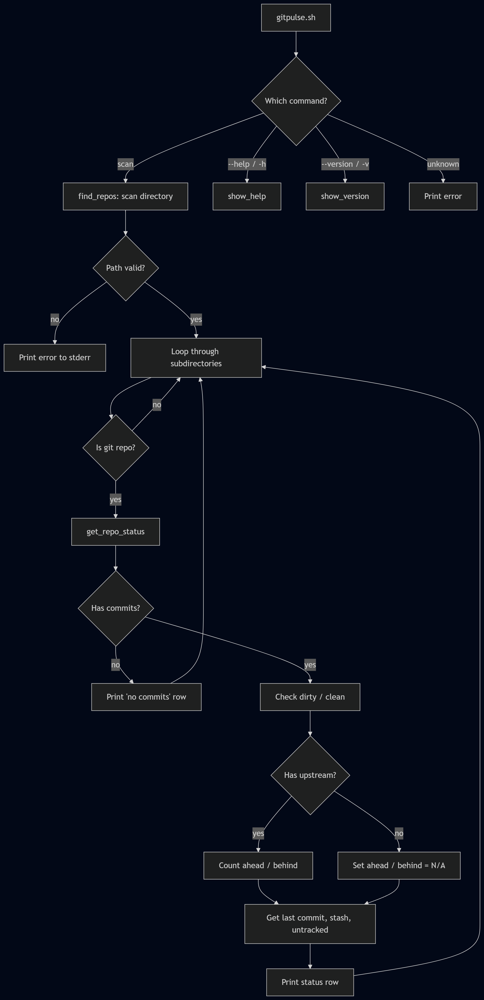
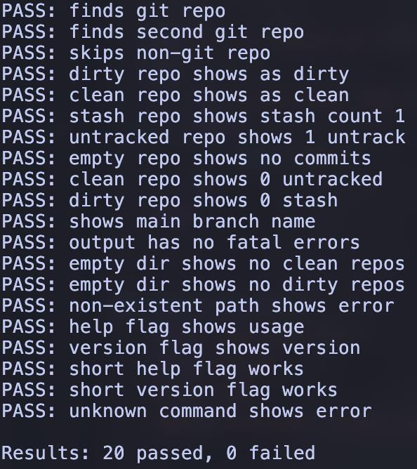
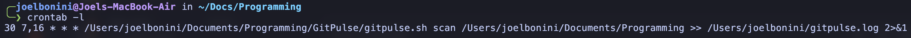
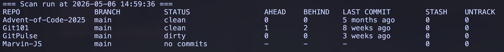
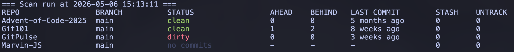

# GitPulse

> Monitor the heartbeat of all your Git repos

**Projektarbeit M122 – LB02**
**Bash Scripting**

---

**Autor:** Joel Bonini
**Klasse:** AP25d
**Abgabedatum:** 07.05.2026

---

## Inhaltsverzeichnis

1. [Einleitung](#1-einleitung)
2. [Fachliche Beschreibung / Businessanalyse](#2-fachliche-beschreibung--businessanalyse)
3. [Muss- und Kann-Ziele](#3-muss--und-kann-ziele)
4. [Design](#4-design)
5. [Umsetzung](#5-umsetzung)
6. [Tests und Testqualität](#6-tests-und-testqualität)
7. [Kreativität und Eigenleistung](#7-kreativität-und-eigenleistung)
8. [Fazit](#8-fazit)
9. [Anhang](#9-anhang)

---

## 1. Einleitung

### 1.1 Ausgangslage

Täglich arbeite ich mit vielen verschiedenen Git-Repositories, da ich an mehreren Projekten beteiligt bin. Ob privat oder bei der Arbeit, es ist sehr mühsam, bei jedem einzelnen Projekt nachzuschauen, ob ich etwas vergessen habe zu committen oder ob das Repository sonstige Unsauberkeiten vorweist. Das manuelle Überprüfen ist ausserdem sehr zeitaufwändig und fehleranfällig.

### 1.2 Projektidee

Ein Bash-CLI-Tool soll dieses Problem lösen, indem es alle Git-Repositories in einem Verzeichnis scannt und einen Bericht ausgibt, der sofort darstellt, wo etwas unsauber ist. Dies kann automatisiert jeweils morgens und abends via Cronjob ausgeführt werden, damit man stets die Übersicht behält. Alle Informationen werden in einer übersichtlichen Tabelle ausgegeben. Besonders wichtig ist dabei der Status des Projektes: auf welcher Branch gerade gearbeitet wird, ob uncommitted oder unpushed Changes vorhanden sind, und wie lange der letzte Commit her ist.

### 1.3 Abgrenzung

Das Tool ist ausschliesslich CLI-basiert, es gibt keine GUI. Git-Operationen wie push, pull oder commit werden nicht ausgeführt, damit nicht versehentlich irgendwelche Changes automatisch gepusht werden. GitPulse dient ausschliesslich zur Informationsbeschaffung. Es werden auch keine Abfragen an Remote-Server getätigt, alle Daten werden lokal ausgelesen.

---

## 2. Fachliche Beschreibung / Businessanalyse

### 2.1 Zielgruppe

GitPulse richtet sich an Entwickler und IT-Fachleute, die mit mehreren Git-Repositories gleichzeitig arbeiten. Speziell angesprochen sind Lernende wie ich, die Schulprojekte, persönliche Projekte und Arbeitsprojekte parallel verwalten. Wer regelmässig zwischen verschiedenen Repos wechselt, verliert schnell den Überblick.

### 2.2 Ist-Zustand

Aktuell muss ich manuell mit `cd` in jedes Repo navigieren und dort `git status` ausführen, um zu sehen ob etwas offen ist. Danach prüfe ich mit `git log` den letzten Commit und schaue ob ich noch Commits pushen muss. Bei 4-5 aktiven Projekten dauert das schnell 5-10 Minuten, und ich vergesse trotzdem regelmässig ein Repo zu prüfen. Besonders ärgerlich ist es, wenn ich am nächsten Tag merke, dass ich Changes nicht gepusht habe.

### 2.3 Soll-Zustand

Mit GitPulse reicht ein einziger Befehl, um eine vollständige Übersicht aller Repos zu erhalten. Die Ausgabe zeigt pro Repo den Branch, den Status (clean/dirty), wie viele Commits ahead oder behind sind, den letzten Commit-Zeitpunkt, Stash-Anzahl und ungetrackte Dateien. Im Terminal wird die Ausgabe farbcodiert dargestellt, in Log-Files automatisch ohne Farben. Via Cronjob kann der Scan zweimal täglich automatisch laufen.

### 2.4 Nutzen

Der grösste Mehrwert ist die Zeitersparnis und die Sicherheit, dass kein Repo vergessen geht. Statt 5-10 Minuten manuelles Prüfen dauert ein Scan wenige Sekunden. Durch die Cronjob-Integration bekomme ich morgens und abends automatisch einen Bericht. Bash ist dafür die perfekte Technologie: es ist auf jedem Unix-System vorinstalliert und eignet sich hervorragend, um bestehende Tools wie `git`, `grep`, `printf` und `basename` zu kombinieren. Das entspricht der Unix-Philosophie – kleine, spezialisierte Werkzeuge, die zusammen etwas Grösseres ergeben.

---

## 3. Muss- und Kann-Ziele

### 3.1 Muss-Ziele

1. Scan eines Verzeichnisses auf Git-Repositories
2. Tabellarische Ausgabe mit Status, Branch, Ahead/Behind, Last Commit, Stash, Untracked
3. Edge Cases abfangen: Repos ohne Remote, Repos ohne Commits, leere Verzeichnisse
4. Cronjob-Integration für automatische Reports
5. Mindestens 20 Testfälle
6. Fehlerbehandlung bei ungültigen Pfaden

### 3.2 Kann-Ziele

- Standup-Modus (Commits der letzten Tage gruppiert pro Repo)
- Cleanup-Kommando (bereits gemergte Branches löschen)
- Watch-Modus mit Live-Updates
- JSON-Output für maschinelle Weiterverarbeitung
- Desktop-Notifications bei Statusänderungen
- Bash-Completion für Tab-Vervollständigung

### 3.3 Zielabdeckung

Alle Muss-Ziele wurden vollständig erreicht. Die Kann-Ziele wurden aus Zeitgründen nicht umgesetzt. Die Architektur des Projektes ist jedoch modular aufgebaut (mit separaten Ordnern für `lib/`, `commands/` und `tests/`), sodass sich zusätzliche Kommandos wie Standup oder Cleanup problemlos ergänzen lassen, ohne bestehenden Code umschreiben zu müssen.

---

## 4. Design

### 4.1 Architektur

GitPulse ist modular aufgebaut. Der Entry Point `gitpulse.sh` fungiert als Dispatcher: er parst die Argumente und leitet an das richtige Kommando weiter. Wiederverwendbare Funktionen wie Farbausgabe, Logging und Hilfsfunktionen liegen in `lib/utils.sh` und werden per `source` eingebunden. Die eigentlichen Kommandos liegen in `commands/` – aktuell nur `scan.sh`, aber durch die Struktur können neue Kommandos einfach als neue Dateien hinzugefügt werden. Tests liegen isoliert in `tests/`.

Diese Trennung hat mehrere Vorteile: Jede Datei hat eine klare Verantwortung, Code wird nicht dupliziert, und man kann einzelne Teile unabhängig testen. Das ist ein deutlicher Unterschied zu einem einzelnen langen Script, wie man es bei vielen Bash-Projekten sieht.

### 4.2 Programmablaufplan (PAP)



*Abbildung 1: Programmablaufplan GitPulse*

### 4.3 Dateistruktur

```
gitpulse/
├── gitpulse.sh          # Main Entry Point und Dispatcher
├── lib/
│   └── utils.sh         # Farben, Logging, Hilfsfunktionen
├── commands/
│   └── scan.sh          # Scan-Kommando mit find_repos, get_repo_status, cmd_scan
├── tests/
│   └── test_scan.sh     # Testsuite mit 20 Testfällen
└── README.md            # Projektbeschreibung und Nutzungsanleitung
```

---

## 5. Umsetzung

### 5.1 Technologiewahl

Bash war Teil der Aufgabenstellung, aber es ist auch die richtige Wahl für dieses Projekt. Bash ist auf jedem Unix-System (Linux, macOS) vorinstalliert – es braucht keine zusätzlichen Abhängigkeiten. Ausserdem ist Bash perfekt geeignet, um bestehende CLI-Tools wie `git`, `grep`, `awk`, `printf` und `basename` zu kombinieren.

### 5.2 Kernfunktionen

- **`is_git_repo()`** – Prüft ob ein Verzeichnis ein Git-Repository ist, indem es checkt ob ein `.git`-Ordner existiert. Gibt einen Exit-Code zurück (0 = ja, 1 = nein), was es ermöglicht die Funktion direkt in `if`-Bedingungen zu verwenden.

- **`find_repos()`** – Nimmt einen Verzeichnispfad entgegen und loopt durch alle Unterverzeichnisse. Für jedes wird `is_git_repo` aufgerufen. Gefundene Repos werden per `echo` ausgegeben, eine pro Zeile. Fehler (ungültiger Pfad) werden auf stderr ausgegeben mit `>&2`.

- **`get_repo_status()`** – Das Herzstück des Tools. Nimmt einen Repo-Pfad und sammelt alle relevanten Git-Informationen: Branch-Name, dirty/clean Status, Ahead/Behind-Counts, letzter Commit, Stash-Anzahl und ungetrackte Dateien. Nutzt `git -C` um Git-Befehle auszuführen ohne ins Verzeichnis wechseln zu müssen. Gibt eine formatierte Zeile mit `printf` aus.

- **`cmd_scan()`** – Der Orchestrator. Gibt den Timestamp und die Tabellenheader aus, ruft `find_repos` auf, und führt für jedes gefundene Repo `get_repo_status` aus. Diese Funktion wird vom Dispatcher in `gitpulse.sh` aufgerufen.

### 5.3 Wichtige Bash-Konzepte

Anforderung erfüllt: **Mindestens 3x Loop + if/then**.

| Konzept | Verwendung |
|---------|------------|
| `for`-Loops | `find_repos` Loop über Verzeichnisse, `cmd_scan` Loop über Repos, Test-Fixtures Setup |
| `if/then/else` | Dirty-Check, Empty-Repo-Check, Terminal-Detection, Upstream-Check |
| `case/esac` | Subcommand-Dispatch in `gitpulse.sh` (scan, --help, --version, unknown) |
| Funktionen mit `local` | Scope-Kontrolle, verhindert globale Variablen-Kollisionen |
| `source` für Module | `lib/utils.sh` und `commands/scan.sh` werden dynamisch geladen |
| Pipes | `\| grep`, `\| wc -l`, `\| tr -d ' '` |
| Command Substitution | `$(git -C ...)`, `$(basename ...)`, `$(date ...)` |
| Default-Werte | `${1:-scan}`, `${1:-.}` für optionale Argumente |
| Heredoc | `cat << EOF` für den Help-Text |
| ANSI Escape Codes | Farbige Terminal-Ausgabe (grün, rot, gelb, blau, grau) |
| Exit Codes | Funktionen nutzen Exit-Codes als Rückgabewerte |
| stderr-Redirect | `>&2` für Fehlermeldungen, trennt Fehler von Daten |
| Terminal-Detection | `[[ -t 1 ]]` erkennt ob stdout ein Terminal oder eine Pipe/Datei ist |
| `printf` | Formatierte Spaltenausgabe mit fixer Breite (`%-20s`) |
| `set -euo pipefail` | Strict Mode – Script bricht bei Fehlern sofort ab |

### 5.4 Cronjob-Integration

Der Cronjob wurde auf meinem Mac eingerichtet und läuft zweimal täglich:

```
30 7,16 * * * /Users/joelbonini/Documents/Programming/GitPulse/gitpulse.sh scan /Users/joelbonini/Documents/Programming >> /Users/joelbonini/gitpulse.log 2>&1
```

- **07:30** – Morgendlicher Scan, damit ich sehe was gestern offen geblieben ist
- **16:30** – Abendlicher Scan, damit ich vor Feierabend noch alles committen/pushen kann
- Output wird mit `>>` an das Log-File angehängt (nicht überschrieben)
- Farben werden automatisch deaktiviert, da die Terminal-Detection (`[[ -t 1 ]]`) erkennt, dass stdout kein Terminal ist
- Jeder Scan-Eintrag im Log beginnt mit einem Timestamp (`=== Scan run at 2026-04-16 10:14:20 ===`), damit die Einträge klar voneinander getrennt sind
- Fehler werden mit `2>&1` ebenfalls ins Log geschrieben

### 5.5 Herausforderungen und Lösungen

Während der Entwicklung sind mehrere Probleme aufgetaucht, die ich lösen musste:

- **Repos ohne Commits:** Wenn ein Repo mit `git init` erstellt wurde aber noch keinen Commit hat, crasht `git log`. Gelöst mit einem frühzeitigen Check (`git rev-parse HEAD`), der bei Fehler eine Platzhalter-Zeile ausgibt und die Funktion mit `return` verlässt.

- **Repos ohne Remote:** `git rev-list @{u}..HEAD` schlägt fehl wenn kein Upstream konfiguriert ist. Gelöst mit einem vorherigen Check ob ein Upstream existiert (`git rev-parse --abbrev-ref @{u}`). Falls nicht, werden Ahead/Behind auf "N/A" gesetzt.

- **ANSI-Codes in printf:** Die unsichtbaren Farbcodes werden von `printf` als Zeichen gezählt, was die Spaltenbreiten verschiebt. Gelöst mit einer dynamischen `STATUS_WIDTH`-Variable, die je nach Terminal-Detection unterschiedliche Werte hat (33 mit Farben, 22 ohne).

- **Fehlermeldungen im Output:** Git-Fehlermeldungen haben den Tabellenoutput verschmutzt. Gelöst durch konsequente Umleitung von stderr (`2>/dev/null` bei Git-Befehlen, `>&2` bei eigenen Fehlermeldungen).

- **UTF-8 Symbole (✓/✗):** Diese Zeichen werden als mehrere Bytes gezählt, was zu Spaltenverschiebungen führt. Gelöst indem die Symbole entfernt und nur die Wörter "clean"/"dirty" verwendet werden.

---

## 6. Tests und Testqualität

### 6.1 Teststrategie

Die Tests sind fixture-basiert: es werden temporäre Git-Repos mit bekannten Zuständen erstellt (clean, dirty, stash, untracked, no-commits, empty dir). Dafür wird `mktemp -d` verwendet, das ein temporäres Verzeichnis erstellt. Am Ende der Tests wird dieses mit `rm -rf` aufgeräumt, sodass keine Artefakte zurückbleiben.

Ein externes Test-Framework war nicht nötig. Stattdessen habe ich zwei eigene Assert-Funktionen geschrieben: `assert_contains` prüft ob ein String in der Ausgabe vorkommt, `assert_not_contains` prüft das Gegenteil. Beide geben PASS oder FAIL aus und zählen die Ergebnisse mit.

Die Tests laufen komplett isoliert und sind reproduzierbar – sie hängen nicht von echten Repos ab, sondern erstellen ihre eigenen. Der Exit-Code ist 0 bei Erfolg und 1 bei Fehler, was die Tests CI-tauglich macht.

### 6.2 Testfälle

| #  | Testfall                         | Erwartetes Ergebnis                          | Tatsächliches Ergebnis                       | Pass/Fail |
|----|----------------------------------|----------------------------------------------|----------------------------------------------|-----------|
| 1  | finds git repo                   | Output enthält `real-repo`                   | Output enthält `real-repo`                   | Pass      |
| 2  | finds second git repo            | Output enthält `also-a-repo`                 | Output enthält `also-a-repo`                 | Pass      |
| 3  | skips non-git repo               | Output enthält kein `not-a-repo`             | Output enthält kein `not-a-repo`             | Pass      |
| 4  | dirty repo shows as dirty        | Zeile für dirty-repo enthält `dirty`         | Zeile für dirty-repo enthält `dirty`         | Pass      |
| 5  | clean repo shows as clean        | Zeile für clean-repo enthält `clean`         | Zeile für clean-repo enthält `clean`         | Pass      |
| 6  | stash repo shows stash count 1   | Zeile für stash-repo enthält ` 1 `           | Zeile für stash-repo enthält ` 1 `           | Pass      |
| 7  | untracked repo shows 1 untrack   | Zeile für untracked-repo enthält ` 1`        | Zeile für untracked-repo enthält ` 1`        | Pass      |
| 8  | empty repo shows no commits      | Zeile für empty-repo enthält `no commits`    | Zeile für empty-repo enthält `no commits`    | Pass      |
| 9  | clean repo shows 0 untracked     | Zeile für clean-repo enthält ` 0`            | Zeile für clean-repo enthält ` 0`            | Pass      |
| 10 | dirty repo shows 0 stash         | Zeile für dirty-repo enthält ` 0`            | Zeile für dirty-repo enthält ` 0`            | Pass      |
| 11 | shows main branch name           | Zeile enthält `main` oder `master`           | Zeile enthält `main`                         | Pass      |
| 12 | output has no fatal errors       | Kein `fatal` im Output                       | Kein `fatal` im Output                       | Pass      |
| 13 | empty dir shows no clean repos   | Kein `clean` im Output                       | Kein `clean` im Output                       | Pass      |
| 14 | empty dir shows no dirty repos   | Kein `dirty` im Output                       | Kein `dirty` im Output                       | Pass      |
| 15 | non-existent path shows error    | Fehler `does not exist` auf stderr           | Fehler `does not exist` auf stderr           | Pass      |
| 16 | help flag shows usage            | `--help` Output enthält `Usage`              | `--help` Output enthält `Usage`              | Pass      |
| 17 | version flag shows version       | `--version` Output enthält `GitPulse`        | `--version` Output enthält `GitPulse`        | Pass      |
| 18 | short help flag works            | `-h` Output enthält `Usage`                  | `-h` Output enthält `Usage`                  | Pass      |
| 19 | short version flag works         | `-v` Output enthält `GitPulse`               | `-v` Output enthält `GitPulse`               | Pass      |
| 20 | unknown command shows error      | Unbekannter Befehl zeigt `Unknown`           | Unbekannter Befehl zeigt `Unknown`           | Pass      |

### 6.3 Testergebnisse



---

## 7. Kreativität und Eigenleistung

GitPulse hebt sich von einer Basis-Lösung durch mehrere Punkte ab:

- **Modulare Architektur** – Das Projekt ist nicht ein einzelnes langes Script, sondern aufgeteilt in `lib/`, `commands/` und `tests/`. Neue Kommandos können als eigene Dateien hinzugefügt werden, ohne bestehenden Code zu ändern.

- **Terminal-adaptive Ausgabe** – Das Tool erkennt automatisch ob es in einem Terminal oder in einer Pipe/Datei läuft. Im Terminal werden Farben angezeigt, in Log-Files werden sie automatisch deaktiviert. Dadurch funktioniert die Cronjob-Integration ohne zusätzliche Flags.

- **Robuste Edge-Case-Behandlung** – Repos ohne Commits, Repos ohne Remote, leere Verzeichnisse und ungültige Pfade werden alle sauber abgefangen, ohne dass das Tool crasht.

- **Eigene Test-Infrastruktur** – Statt ein externes Framework zu verwenden, habe ich eigene Assert-Funktionen geschrieben. Die 20 Tests nutzen Fixtures (temporäre Repos mit bekannten Zuständen) und sind komplett isoliert und reproduzierbar.

- **Alltagstauglich** – Das Tool läuft tatsächlich auf meinem Rechner als Cronjob und wird im Alltag genutzt. Es ist nicht nur ein Schulprojekt, sondern ein echtes Werkzeug.

---

## 8. Fazit

### 8.1 Was habe ich gelernt?

Dieses Projekt hat mir viel über Bash beigebracht, das über einfaches Scripting hinausgeht. Konkret habe ich gelernt: Bash modular zu strukturieren mit `source`, Separation of Concerns umzusetzen (utils vs. commands), mit `set -euo pipefail` einen Strict Mode zu verwenden, stderr von stdout zu trennen für saubere Datenströme, Exit-Codes als Rückgabewerte zu nutzen, `printf` für formatierte Tabellenausgaben einzusetzen, ANSI Escape Codes für Farbausgaben zu verwenden, Terminal-Detection mit `[[ -t 1 ]]` umzusetzen, `mktemp` für isolierte Tests zu nutzen, und `git -C` für Git-Befehle ohne Verzeichniswechsel zu verwenden.

### 8.2 Was würde ich anders machen?

Mit mehr Erfahrung würde ich von Anfang an mehr Zeit für die Planung einplanen. Einige Probleme wie die ANSI-Spaltenbreite hätte ich früher erkennen können, wenn ich die Ausgabe von Anfang an sowohl im Terminal als auch in einer Datei getestet hätte. Ausserdem würde ich ein bestehendes Test-Framework wie `bats` evaluieren – meine eigene Lösung funktioniert, aber `bats` bietet mehr Features. Die Funktion `get_repo_status` ist relativ lang und könnte weiter aufgeteilt werden.

### 8.3 Ausblick

Mit mehr Zeit würde ich folgende Features ergänzen: einen Standup-Modus der zeigt was ich in den letzten Tagen committed habe (nützlich für Berichte), ein Cleanup-Kommando das bereits gemergte Branches löscht, einen Watch-Modus der periodisch scannt und bei Änderungen benachrichtigt, JSON-Output für maschinelle Weiterverarbeitung, und Bash-Completion für Tab-Vervollständigung der Kommandos und Flags.

---

## 9. Anhang

### 9.1 Screenshots





### 9.2 Repository

[GitHub – GitPulse](https://github.com/kazee72/GitPulse)